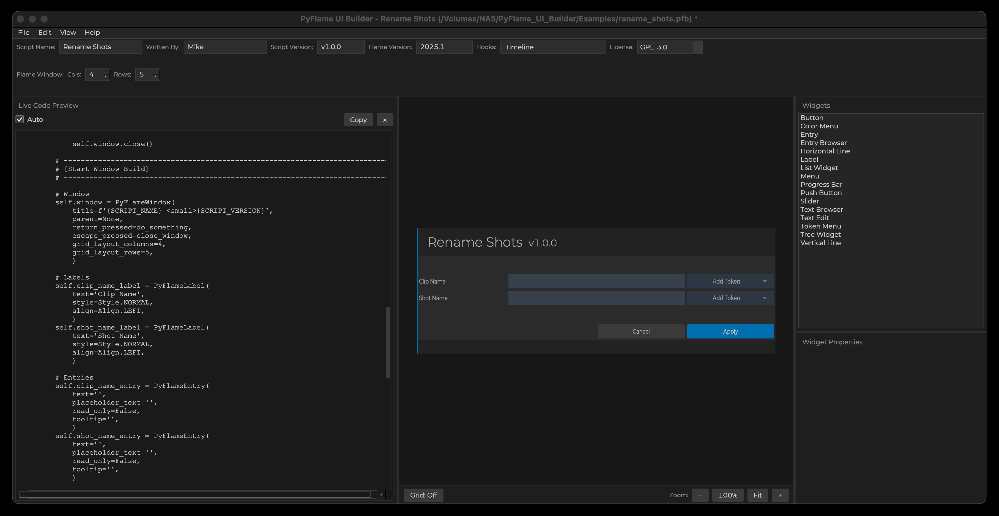

# PyFlame UI Builder

**Version:** 1.0.0<br>
**Author:** Michael Vaglienty<br>
**License:** GPL-3.0<br>
**GitHub:** https://github.com/logik-portal/pyflame-ui-builder<br>

A desktop UI builder for Autodesk Flame Python scripts.

Generates a ready-to-use Flame script with custom UI built from PyFlame UI widgets.

By default windows created with this script will close inside of Flame by hitting escape.

**Script logic will need to be added after creation.**

**Scripts created with PyFlame UI Builder require at least Flame 2025.1**

## Platform Support

- **Runs on MacOS only**
- Generated scripts work on Mac and Linux

## Requirements

- Python 3.11+
- PySide6
- macOS only (optional): `pyobjc-framework-Cocoa`

Install dependencies:

```bash
pip3 install -r requirements.txt
```

## Run

```bash
python3 pyflame_ui_builder.py
```

## Basic workflow

1. Set script details in the top bar.
2. Set size in columns and rows of Flame Window. Columns and rows can be added later by adjusting the Flame Window values or right-clicking in the Flame Window UI.
3. Add widgets to layout by dragging the widget name from the widegts panel to the Flame Window UI.
4. Set widget sizing when available. Some widgets can span multiple grid squares. Resizeable widgets will have handles once dropped in the Flame Window UI.
5  Adjust widget properties in Widget Property panel.
4. Preview generated code (optional).
5. Generate script via **File → Generate Script...**. Set the Flame Python path as the location. Commonly /opt/Autodesk/shared/python.
6. Start Flame to preview the new window.
7. Add custom logic to widgets/script in code editor of your choice. A stub file for the pyflame library is included with the script to assist working with the widgets in your code editor.

## Example files

Two example files can be loaded from /pyflame_ui_builder/examples

## Screenshots

<p align="center">
  
</p>

<p align="center">
  
</p>

## Note

Files created by **File → Save** are not meant to be loaded into Flame. They are just project files for PyFlame UI Builder.
To create a script that can be loaded in Flame go to **File → Generate Script...**.

## Canvas controls

- Left mouse drag on selected widget: move/resize (where allowed)
- Right-click widget: context menu actions (Undo, optional Redo, Duplicate, Delete)
- Arrow keys: nudge selected widget by one grid cell

## Grid / zoom

Use the bottom control row in the canvas pane for Grid toggle and zoom controls.
Grid is **Off by default**.
Grid visibility only affects drawing; snapping remains active.

## Help

- Available in the **Help** menu.

Help content is sourced from:
- `docs/help/getting-started.md`
- `docs/help/keyboard-shortcuts.md`

## License

GNU General Public License v3.0 (GPL-3.0) (see `LICENSE`).
